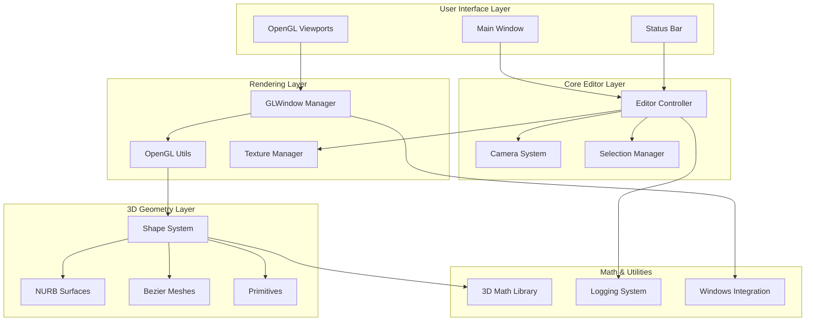
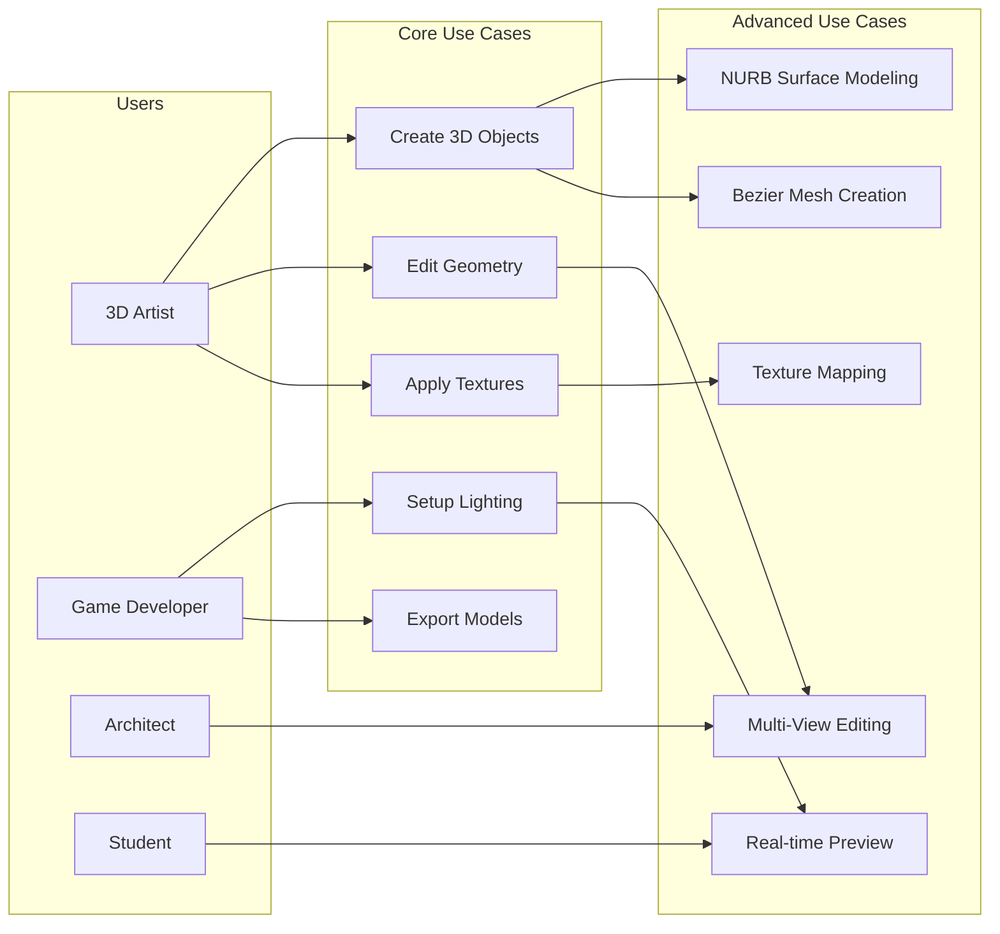
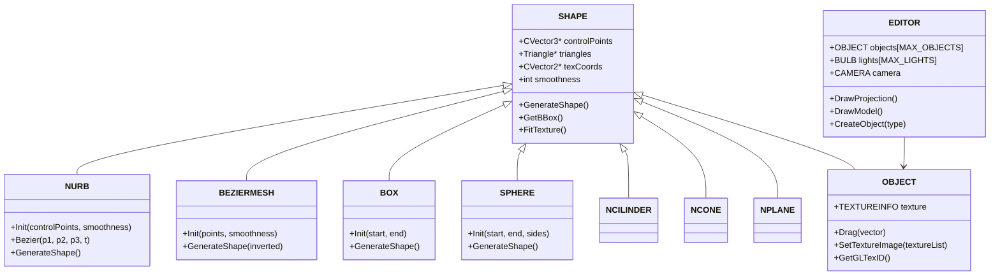
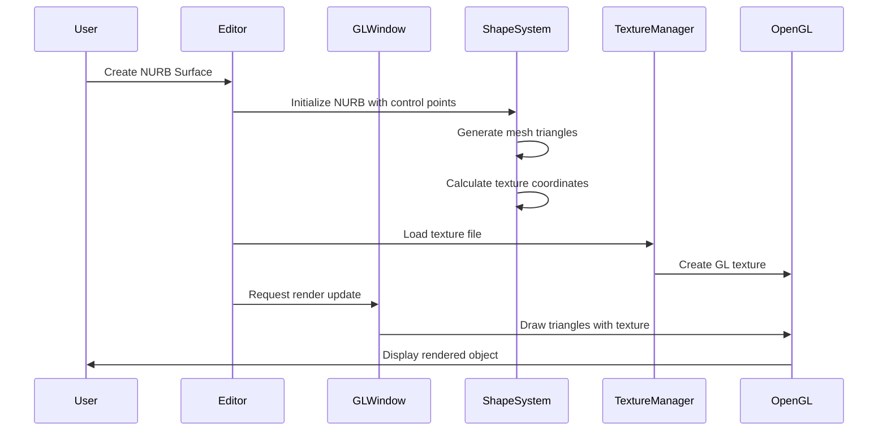

# 3D Editor - Legacy Application Modernized

A comprehensive 3D modeling and editing application originally developed 20 years ago, now modernized to build and run on Windows 11 with modern toolchains. This editor supports advanced 3D shape creation, texture management, lighting systems, and real-time OpenGL rendering.

## 🎯 Project Overview

This 3D editor provides a complete environment for creating and manipulating 3D objects with support for:
- **Advanced 3D Shapes**: NURB surfaces, Bezier meshes, geometric primitives (spheres, boxes, cylinders, cones)
- **Texture Management**: BMP texture loading, UV mapping, texture transformation
- **Lighting System**: Dynamic light placement with customizable properties
- **Multi-View Interface**: Orthographic projections (Front, Top, Left) and 3D perspective view
- **Real-time Rendering**: OpenGL-based rendering with multiple render modes

## 🏗️ Architecture Overview

The application follows a modular architecture with clear separation of concerns:



### Core Components

#### 1. **Editor Controller** (`editor.cpp/h`)
- Central orchestrator managing all editor operations
- Handles user interactions, view management, and object manipulation
- Manages selection, transformation, and rendering states
- Coordinates between UI events and 3D operations

#### 2. **OpenGL Window System** (`glwindow.cpp/h`)
- Multi-viewport OpenGL window management
- Handles window creation, context switching, and event routing
- Supports both windowed and fullscreen modes
- Manages child windows for different view perspectives

#### 3. **Shape System** (`shapes.cpp/h`)
- Hierarchical shape class system with base `SHAPE` class
- Specialized implementations for complex surfaces (NURB, Bezier)
- Geometric primitives (Box, Sphere, Cylinder, Cone, Plane)
- Advanced surface types (Bevels, End caps, Inverted caps)

#### 4. **Texture Management** (`texturemanager.cpp/h`)
- BMP image loading and OpenGL texture binding
- UV coordinate generation and transformation
- Texture scaling, shifting, and rotation
- Multi-texture support with texture atlas management

#### 5. **3D Mathematics** (`3dmath.cpp/h`)
- Vector and matrix operations
- Geometric transformations and projections
- Camera calculations and view transformations
- Collision detection and spatial queries

## 🎮 Use Cases



### Detailed Use Case Scenarios

#### Primary Use Cases

1. **3D Object Creation**
   - Select shape type (NURB, Bezier, Primitive)
   - Define control points through interactive placement
   - Adjust smoothness and resolution parameters
   - Preview in real-time across multiple viewports

2. **Geometry Editing**
   - Select objects or control points
   - Transform via drag operations (move, rotate, scale)
   - Snap to grid for precision modeling
   - Undo/redo operations for iterative design

3. **Texture Application**
   - Load BMP texture files
   - Apply textures to selected objects
   - Adjust UV mapping coordinates
   - Transform textures (scale, rotate, translate)

4. **Lighting Setup**
   - Place light sources in 3D space
   - Configure light properties (color, intensity, range)
   - Preview lighting effects in real-time
   - Generate lightmaps for static lighting

## 🛠️ Technical Architecture

### Class Hierarchy



### Data Flow Architecture



## 🚀 Getting Started

### Prerequisites

Choose one of the following development environments:

#### Option 1: Visual Studio (Recommended)
- **Visual Studio 2022 Community Edition** (free)
- **Desktop development with C++ workload**
- **CMake** (included with Visual Studio)

#### Option 2: MinGW
- **MinGW-w64 with GCC**
- **CMake**

### Quick Installation

Run the provided dependency installer:

```bash
# Run as administrator
install_dependencies.bat
```

This script will guide you through installing the necessary tools.

### Building the Project

#### Using Visual Studio (MSVC)
```bash
# Quick build
build_msvc.bat

# Manual build
mkdir build_msvc
cd build_msvc
cmake .. -G "Visual Studio 17 2022" -A Win32
cmake --build . --config Release
```

#### Using MinGW
```bash
# Quick build
build_mingw.bat

# Manual build
mkdir build_mingw
cd build_mingw
cmake .. -G "MinGW Makefiles"
cmake --build .
```

### Running the Application

After successful build:
- **MSVC**: `build_msvc\bin\Release\3DEditor.exe`
- **MinGW**: `build_mingw\bin\3DEditor.exe`

## 📁 Project Structure

```
3d_editor/
├── Core Engine
│   ├── main.cpp              # Application entry point
│   ├── editor.cpp/h          # Main editor controller
│   └── windowsistem.cpp/h    # Windows system integration
├── Rendering System
│   ├── glwindow.cpp/h        # OpenGL window management
│   ├── glutils.cpp/h         # OpenGL utilities
│   └── texturemanager.cpp/h  # Texture loading and management
├── 3D Geometry
│   ├── shapes.cpp/h          # Shape class hierarchy
│   ├── nurb.cpp/h           # NURB surface implementation
│   └── 3Dmath.cpp/h         # 3D mathematics library
├── Utilities
│   ├── log.cpp/h            # Logging system
│   └── compat.h             # Compatibility layer
├── Build System
│   ├── CMakeLists.txt       # CMake configuration
│   ├── build_msvc.bat       # MSVC build script
│   └── build_mingw.bat      # MinGW build script
└── Resources
    ├── Editor.rc            # Windows resources
    ├── icon1.ico           # Application icon
    └── *.jpg               # Sample textures
```

## 🔧 Modernization Features

This legacy application has been extensively modernized:

### ✅ Compatibility Improvements
- **Modern Compiler Support**: Updated for MSVC 2022 and GCC
- **CMake Build System**: Cross-platform build configuration
- **Unicode Compatibility**: Fixed string handling for modern Windows
- **SAFESEH Compliance**: Disabled for legacy library compatibility
- **Deprecated API Updates**: Replaced obsolete OpenGL and Windows APIs

### ✅ Enhanced Functionality
- **BMP Texture Loading**: Replaced problematic JPEG library
- **Memory Management**: Fixed memory leaks and buffer overflows
- **Error Handling**: Improved error reporting and logging
- **Build Automation**: Automated dependency installation and building

### ✅ Code Quality
- **Static Analysis**: Resolved compiler warnings and errors
- **Type Safety**: Fixed implicit conversions and type mismatches
- **Resource Management**: Proper cleanup and resource deallocation

## 🎨 Features

### 3D Modeling Capabilities
- **NURB Surfaces**: Non-uniform rational B-splines for smooth surfaces
- **Bezier Meshes**: Parametric surface patches
- **Geometric Primitives**: Boxes, spheres, cylinders, cones, planes
- **Advanced Shapes**: Bevels, end caps, inverted surfaces

### Editing Tools
- **Multi-View Interface**: Front, top, left orthographic + 3D perspective
- **Precision Tools**: Grid snapping, coordinate display
- **Selection System**: Object and control point selection
- **Transformation Tools**: Move, rotate, scale operations

### Rendering Features
- **Real-time Preview**: Immediate visual feedback
- **Multiple Render Modes**: Points, wireframe, solid fill
- **Texture Mapping**: UV coordinate generation and transformation
- **Dynamic Lighting**: Point lights with customizable properties

### File Operations
- **Project Save/Load**: Custom .3DW file format
- **Texture Import**: BMP image file support
- **Object Export**: Individual object export capability

## 🐛 Known Issues & Solutions

### Grid Line Display
The original issue with grid lines not displaying has been resolved through:
- Updated OpenGL context creation
- Fixed deprecated function calls
- Corrected coordinate transformations

### Legacy Library Compatibility
- **JPEG Library**: Replaced with BMP loader due to stdio compatibility issues
- **GLAUX**: Removed dependency on deprecated OpenGL auxiliary library
- **Windows API**: Updated to use explicit ANSI versions for compatibility

## 🤝 Contributing

This project serves as an excellent example of legacy code modernization. Areas for potential enhancement:

1. **Modern Graphics**: Upgrade to modern OpenGL (3.3+) or DirectX
2. **UI Framework**: Replace Win32 API with modern UI framework
3. **File Formats**: Add support for standard 3D formats (OBJ, FBX, GLTF)
4. **Cross-Platform**: Extend CMake for Linux and macOS support

## 📄 License

This project is provided as-is for educational and development purposes. The original codebase has been modernized while preserving its core functionality and architecture.

## 🔗 Dependencies

- **OpenGL**: 3D graphics rendering
- **Windows API**: System integration and window management
- **CMake**: Build system configuration
- **MSVC/GCC**: C++ compiler toolchain

---

*Successfully modernized from a 20-year-old Visual Studio 6 project to build on Windows 11 with modern toolchains.*
